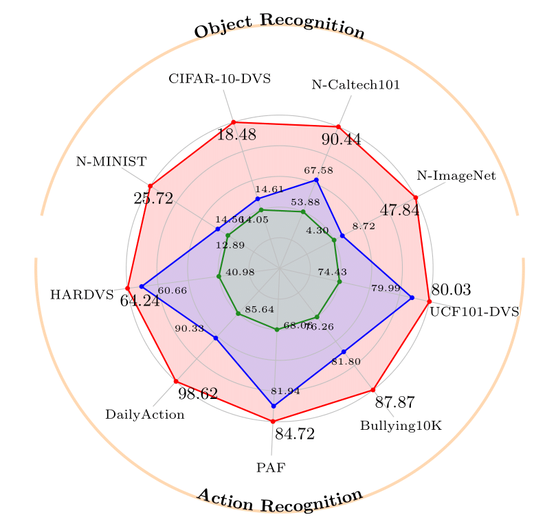
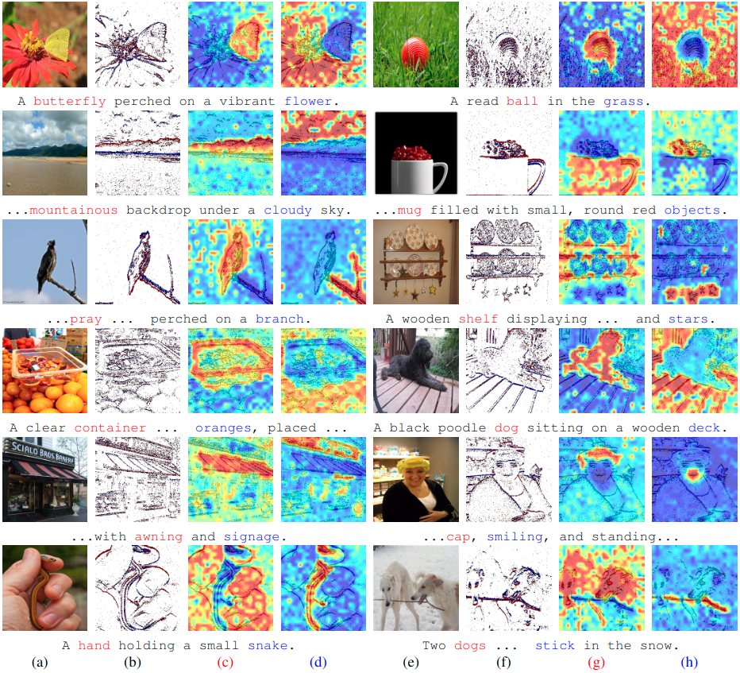
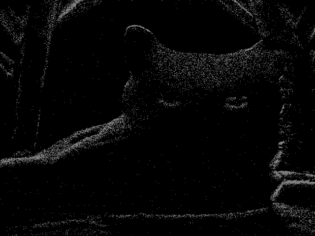

# EZSR: Event-based Zero-Shot Recognition

This repository contains the PyTorch code for our paper "EZSR: Event-based Zero-Shot Recognition".

> [arxiv](https://arxiv.org/pdf/2407.21616) | [project page](https://yan98.github.io/EZSR/)

## Introduction
This paper studies zero-shot object recognition using event camera data. Guided by CLIP, which is pre-trained on RGB images, existing approaches achieve zero-shot object recognition by maximizing embedding similarities between event data encoded by an event encoder and RGB images encoded by the CLIP image encoder. Alternatively, several methods learn RGB frame reconstructions from event data  for the CLIP image encoder. However, these approaches often result in suboptimal zero-shot performance.

This study develops an event encoder without relying on additional reconstruction networks. We theoretically analyze the performance bottlenecks of previous approaches: global similarity-based objective (i.e., maximizing the embedding similarities) cause semantic misalignments between the learned event embedding space and the CLIP text embedding space due to the degree of freedom. To mitigate the issue, we explore a scalar-wise regularization strategy. Furthermore, to scale up the number of events and RGB data pairs for training, we also propose a pipeline for synthesizing event data from static RGB images.

Experimentally, our data synthesis strategy exhibits an attractive scaling property, and our method achieves superior zero-shot object recognition performance on extensive standard benchmark datasets, even compared with past supervised learning approaches. For example, we achieve 47.84% zero-shot accuracy on the N-ImageNet dataset. 
## Framework

<div align=center>

</div>

## Overview

<div align=center>

</div>

## Heatmap w.r.t to Text

<div align=center>

</div>


## Requirement
- torch 2.3.0+cu121
- transformers 4.44.0
- timm 0.9.16

## Usage
```python
import torch
from eva_clip import create_model_and_transforms, get_tokenizer
from dataset.dataset import load_and_preprocess

model_name = "EVA02-CLIP-bigE-14-plus" 
pretrained = "EZSR-CLIP-bigE-14-plus.pt" # path to the downloaded model

event_path = "asset/test_event.npz"
SENSOR_H = 480
SENSOR_W = 640
event_length = 15000
representation = "histogram"
event_viz_path = "event.png"

caption = ["a dragon", "a dog", "a cat"]

device = "cuda" if torch.cuda.is_available() else "cpu"
model, _, preprocess = create_model_and_transforms(model_name, None, force_custom_clip=True)
checkpoint = torch.load(pretrained, map_location="cpu")
model.load_state_dict(checkpoint,strict=False)
        
tokenizer = get_tokenizer(model_name)
model = model.to(device)

event = load_and_preprocess(event_path, SENSOR_H, SENSOR_W, event_length, representation, event_viz_path, preprocess).unsqueeze(0).to(device)
text = tokenizer(["a diagram", "a dog", "a cat"]).to(device)

with torch.no_grad(), torch.cuda.amp.autocast():
    event_features = model.encode_image(event)
    text_features = model.encode_text(text)
    event_features /= event_features.norm(dim=-1, keepdim=True)
    text_features /= text_features.norm(dim=-1, keepdim=True)
    text_probs = (100.0 * event_features @ text_features.T).softmax(dim=-1)

print("Label probs:", text_probs)  # prints: [[3.2870e-06, 5.1930e-04, 9.9948e-01]]
```
The event and paired RGB images for  `asset/test_event.npz`.
<p align="left">
  
  
</p>

## Evaluation of Zero-shot Event Classification Performance

We provide an example of evaluating `CLIP-bigE-14-plus` on the N-ImageNet dataset. The dataset can be obtained [here](https://github.com/82magnolia/n_imagenet).  

```bash
MODEL=EVA02-CLIP-bigE-14-plus
PRETRAINED=EZSR-CLIP-bigE-14-plus.pt
CUDA_VISIBLE_DEVICES=3 python engine_evaluate.py \
        --batch_size 1 \
        --num_workers 7 \
        --force_custom_clip \
        --model $MODEL \
        --pretrained $PRETRAINED \
        --dataset imagenet \
        --root ...N_ImageNet \             #specify the path accordingly
        --input_filename ...val_file.text  #specify the path accordingly
```
Please prepare the pre-trained model.
<div align="left">

| Model Name     | Init   | Weight          |
|:---------------|:-------|:----------------|
| `ViT-B/32`     | OpenAI | TBC             |
| `ViT-B/16`     | OpenAI | TBC             |
| `ViT-B/16`     | EVA    | TBC             |
| `ViT-L/14`     | OpenAI | TBC             |
| `ViT-L/14`     | EVA    | TBC             |
| `ViT-L/14-336` | OpenAI | TBC             |
| `ViT-L/14-336` | EVA    | TBC             |
| `ViT-bigE/14`  | EVA    | [link](https://anu365-my.sharepoint.com/:u:/g/personal/u6169130_anu_edu_au/EcIuoMducKxLo-nrg9w9Wt8BgBLQKLAVFJo78OcSjA7wDQ?e=HcIHHO)     |

</div>

Drop me an email if the link is not working.

## How to get the dataset

```bash
# code is coming soon
```

## Contact
If you have any questions relating to our work, do not hesitate to contact [me](mailto:yan.yang@anu.edu.au?subject=EZSR).

## Acknowledgement
EVA-CLIP is built using the awesome [OpenCLIP](https://github.com/mlfoundations/open_clip), [EVA](https://github.com/baaivision/EVA/tree/master), [BEiT](https://github.com/microsoft/unilm/tree/master/beit), [DeiT](https://github.com/facebookresearch/deit), [N-ImageNet](https://github.com/82magnolia/n_imagenet), and [mae](https://github.com/facebookresearch/mae).

## Citation

```bash
@misc{yang2024ezsreventbasedzeroshotrecognition,
      title={EZSR: Event-based Zero-Shot Recognition}, 
      author={Yan Yang and Liyuan Pan and Dongxu Li and Liu Liu},
      year={2024},
      eprint={2407.21616},
      archivePrefix={arXiv},
      primaryClass={cs.CV},
      url={https://arxiv.org/abs/2407.21616}, 
}
```

