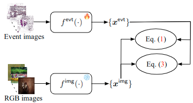

# Event Camera Data Dense Pre-training

This repository contains the PyTorch code for our paper "Event Camera Data Dense Pre-training".

> [paper]() | [arxiv](https://arxiv.org/abs/2311.11533) | [project page](https://yan98.github.io/ECDDP/)

**The code and dataset will come soon!**


## Introduction
This paper introduces a self-supervised learning framework designed for pre-training neural networks tailored to dense prediction tasks using event camera data. Our approach utilizes solely event data for training.

Transferring achievements from dense RGB pre-training  directly to event camera data yields subpar performance. This is attributed to the spatial sparsity inherent in an event image (converted from event data), where many pixels do not contain information. To mitigate this sparsity issue, we encode an event image into event patch features, automatically mine contextual similarity relationships among patches, group the patch features into distinctive contexts, and enforce context-to-context similarities to learn discriminative event features.

For training our framework, we curate a synthetic event camera dataset featuring diverse scene and motion patterns.
Transfer learning performance on downstream dense prediction tasks illustrates the superiority of our method over state-of-the-art approaches.

## Framework

<div align=center>

</div>

## Requirement

Please refer to [requirements.txt](./requirements.txt).

## How to run

```bash
python main.py
```

## How to get the dataset

```bash
python dataset.py
```

## Citation

```

@misc{yang2023eventcameradatadense,
      title={Event Camera Data Dense Pre-training}, 
      author={Yan Yang and Liyuan Pan and Liu Liu},
      year={2023},
      eprint={2311.11533},
      archivePrefix={arXiv},
      primaryClass={cs.CV},
      url={https://arxiv.org/abs/2311.11533}, 
}

